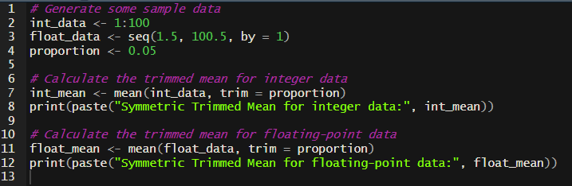

# Trimmed Mean Package:

This package provides a Go function to calculate the trimmed mean of a slice of floating-point or int numbers. The trimmed mean is a robust statistic for central tendency, which removes a specified proportion of the smallest and largest values before computing the mean of the remaining data.


## Installation:

To install the package, run:

```sh
go get github.com/TheFoxForever/assignment_week_9/trimmedmean
```

# Usage
Parameters:
'data': An interface{} that accepts slices of int, int8, int16, int32, int64, float 32, and float64.
'proportion': a 'float64' value that represents the percentage of data trimmed from both ends. Value must be between 0.00 and 1.

Return:
'value': returns the trimmed mean value
'error': Returns an error if input is not a slice or contains unsupported types

# Notes
This function has the same output / use case as R's 'mean' with 'trim' enabled



